# Relatório WordPress + MariaDB

## Integrantes:
- Felipe Parreiras Dias
- José Marconi Almeida

## Explicação sobre a funcionalidade do serviço

### 🔧 WordPress + MariaDB com Docker: o que é e por que usar

WordPress é a plataforma de CMS (Content Management System) mais popular do mundo. Com ela, é possível criar e gerenciar sites, blogs, lojas virtuais e até portais corporativos, tudo através de uma interface gráfica simples e intuitiva. Porém, para funcionar corretamente, ele precisa de um banco de dados relacional onde armazena posts, páginas, usuários, plugins e configurações. É aí que entra o MariaDB, um sistema de banco de dados leve, robusto e compatível com MySQL.

### 🐳 Uso com Docker: múltiplos containers interligados

Com o Docker, cada serviço (WordPress e MariaDB) é isolado em seu próprio container, o que traz diversas vantagens:

- Facilidade de configuração: basta um docker-compose.yml com as imagens e variáveis.
- Padronização de ambiente: funciona da mesma forma em qualquer máquina ou servidor.
- Escalabilidade e manutenção separadas: você pode atualizar o banco ou o WordPress separadamente.
- Rede interna do Docker: o WordPress se comunica com o banco de dados via hostname (db), sem precisar expor o banco na internet.

Esse tipo de arquitetura permite ao estudante ou profissional aprender sobre dependência de serviços, rede entre containers, variáveis de ambiente, healthchecks e persistência de dados com volumes.

### 🌍 Onde isso é aplicado

- Em ambientes de desenvolvimento local, para testar plugins e temas WordPress rapidamente.
- Em ambientes de produção, com ajustes de segurança e persistência.
- Em hospedagens em nuvem, como AWS, Azure ou servidores VPS.
- Em aulas e treinamentos de DevOps, Docker e sistemas distribuídos, como um exemplo didático completo.

## Instruções de instalação do Docker e Docker Compose

### Instalação: 

1- Comandos iniciais sudo para instalação:
```bash
sudo apt update #recomendável atualizar
sudo apt install -y ca-certificates curl gnupg #certificações que podem ser necessárias para a instalação
```

2- Adiciona a chave GPG oficial
```bash
sudo install -m 0755 -d /etc/apt/keyrings
curl -fsSL https://download.docker.com/linux/ubuntu/gpg | \
sudo gpg --dearmor -o /etc/apt/keyrings/docker.gpg
sudo chmod a+r /etc/apt/keyrings/docker.gpg

```

3-  Adiciona o repositório oficial do Docker
```bash
echo \
"deb [arch=$(dpkg --print-architecture) \
signed-by=/etc/apt/keyrings/docker.gpg] \
https://download.docker.com/linux/ubuntu \
$(lsb_release -cs) stable" | \
sudo tee /etc/apt/sources.list.d/docker.list > /dev/null
```

4- Atualiza os pacotes e instala Docker + Compose v2
```bash
sudo apt update
sudo apt install -y docker-ce docker-ce-cli containerd.io docker-buildx-plugin
docker-compose-plugin
```

5- Testar instalação:
```bash
docker –version
docker compose –version
```
> ⚠️ **POSSÍVEIS PROBLEMAS**
> 
> Em caso de não funcionamento, faça a instalação do Docker via browser, baixando, através do instalador, o aplicativo.
> 
> 1- Instale o Docker Desktop:
>   - Baixe: https://www.docker.com/products/docker-desktop
>   - Siga o assistente de instalação.
>   - Durante a instalação, marque a opção “Enable integration with WSL 2”.
>     
> 2- Configure o WSL para usar o Docker Desktop:
>   - No Docker Desktop, vá em Settings > Resources > WSL Integration.
>   - Ative a integração com sua distro (ex: Ubuntu).
> 3- No terminal WSL, execute os comandos de teste de instalação

6- Teste de execução:
```bash
docker run hello-word
```

## Instruções de execução do WordPress com Docker Compose

Após certificar-se de que o Docker Compose foi instalado corretamente, pode-se passar para a etapa de instalação e execução do WordPress. 

1- Criar o arquivo `docker-compose.yml`.
```bash
mkdir docker-compose.yml
```

2- Abrir o arquivo com `nano` e utilizar o script(default):
O arquivo default está neste repositório salvo como `docker-compose.yml`
```bash
mkdir docker-compose.yml
```
```yml
services:
  wordpress:
    image: wordpress:latest
    ports:
      - "8080:80"
    environment:
      WORDPRESS_DB_HOST: db
      WORDPRESS_DB_USER: wpuser
      WORDPRESS_DB_PASSWORD: wppass
      WORDPRESS_DB_NAME: wpdb
    depends_on:
      - db
  db:
    image: mariadb:latest
    environment:
      MYSQL_DATABASE: wpdb
      MYSQL_USER: wpuser
      MYSQL_PASSWORD: wppass
      MYSQL_ROOT_PASSWORD: rootpass
    ports:
      - "3306:3306"
```

> ⚠️ **POSSÍVEIS PROBLEMAS**
>
> Caso a porta 8080 já esteja em uso, utilize outra porta para ter acesso via navegador, como a 8888. 

3- Subir os containers:
```bash
docker compose up   # (Para subir em primeiro plano)
docker compose up -d   # (para subir em segundo plano)
```
> O container deve estar em *up* para que a execução seja bem feita.
> Existem outros comandos envolvendo container para visualiação do programa:
> 
> 1- Para ver containers que estão em execução no momento:
> ```bash
> docker ps
> ```
> 2- Para reiniciar os containers:
> ```bash
> docker compose restart
> ```
> 3- Para parar a execução
> ```bash
> docker compose stop
> ```
> 4- Para parar e apagar os containers
> ```bash
> docker compose down
> ```
> 5- Para ver os Logs
> ```bash
> docker compose logs   #(logs gerais)
> docker compose logs wordpress   #(só logs do wordpress)
> docker compose logs db   #(só logs do banco de dados)
> ```
> 6- Para acessar o terminal direto de cada container:
> ```bash
> docker exec -it (id do container wordpress ou do banco) bash
> ```
> 7- Verificar variáveis de ambiente:
> ```bash
> docker compose config
> ```

## Como acessar o banco de dados (MySql MariaDB)
1- Acessar container do banco
```bash
docker exec -it (id do container wordpress ou do banco) bash
```

2- Dentro do terminal do container:
```bash
mariadb -u root -p
#(Senha do root para o banco (definido no script do arquivo yml, nesse caso: rootpass))
```

3- Comandos de SQL padrão:
  - 3.1 - Mostrar DATABASES:
    ```bash
    SHOW DATABASES
    ```
  - 3.2 - Mostrar Tabelas:
    ```bash
    SHOW TABLES
    ```
  - 3.3 - Seleciona um banco de dados para usar
    ```bash
    USE nome_do_banco
    ```
  - 3.4 - Mostra a estrutura (colunas, tipos, chaves) de uma tabela
    ```bash
    DESCRIBE nome_da_tabela
    ```

4- Backup do banco de dados:
```bash
docker run --rm --network trabalho_1_default mysql \
mysqldump -h db -u wpuser -pwppass wpdb > backup.sql
```
ou
```bash
mysqldump -h 127.0.0.1 -P 3306 -u wpuser -pwppass wpdb > backup.sql
```

5- Para verificar se deu certo:
```bash
ls -lh backup.sql
```
> Em caso de sucesso, deve retornar uma mensagem como:
> ```bash
> -rw-r--r-- 1 josemarconi josemarconi 1.3K Jun 25 10:31 backup.sql
> ```

Para ver as primeiras linhas do BD:
```sql
head backup.sql
```
Em caso de sucesso, deve retornar uma mensagem como:
```bash
-- MySQL dump 10.13 Distrib 9.3.0, for Linux (x86_64)
--
-- Host: db Database: wpdb
-- ------------------------------------------------------
-- Server version 11.8.2-MariaDB-ubu2404
/*!40101 SET @OLD_CHARACTER_SET_CLIENT=@@CHARACTER_SET_CLIENT */;
/*!40101 SET @OLD_CHARACTER_SET_RESULTS=@@CHARACTER_SET_RESULTS
*/;
/*!40101 SET @OLD_COLLATION_CONNECTION=@@COLLATION_CONNECTION */;
/*!50503 SET NAMES utf8mb4 */;
```

## Utilizando o WordPress

1- Após subir os containers, é possível acessar o a url pela porta local:
```
-- http://localhost:(porta_utilizado_no_script - Ex: 8080)/wp-admin/install.php
```

Quando feito isso, entramos na tela para começar a configurar o site, a primeira tela é para definir o idioma padrão: 
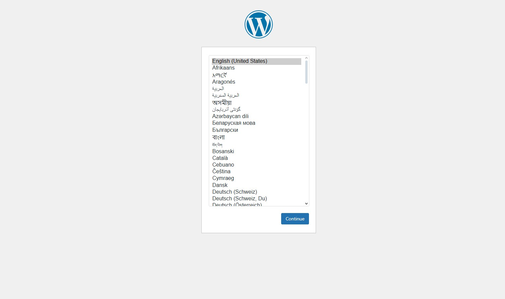

2- Definido o idioma, a tela subsequente vem para configurações iniciais do site: 
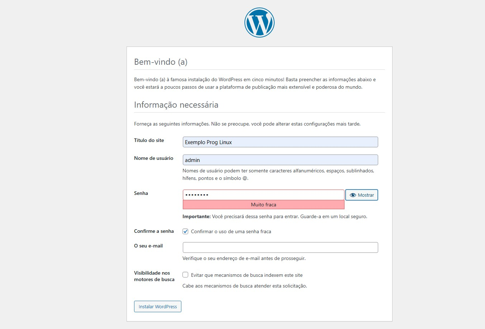

Sendo bem sucedido ele retornara na tela que foi um sucesso e um link direto para acessar e fazer login. 

3- Realizado o Login, entramos no painel principal do WordPress, onde podemos realizar toda a configuração e tematização do nosso site:
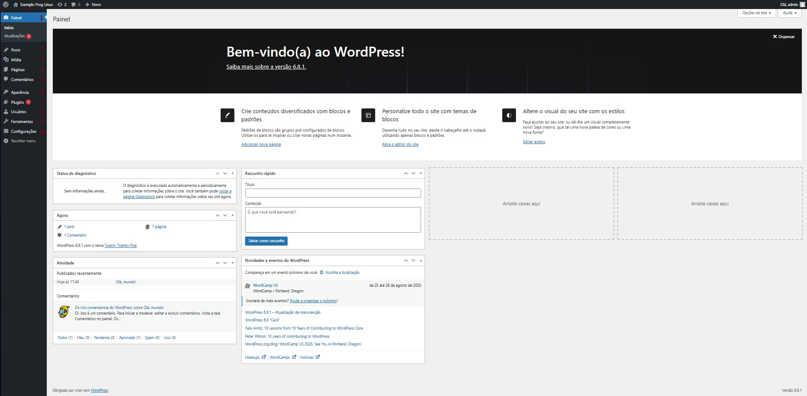

## Menu lateral do WordPress

### 1- Painel
> Área inicial de administração do WordPress. Apresenta uma visão geral do site.
>
> - **Início**: resumo de atividades recentes, rascunhos, status do sistema.
> - **Atualizações**: verifica e instala atualizações de:
>   - Core do WordPress
>   - Temas
>   - Plugins
>   - Traduções

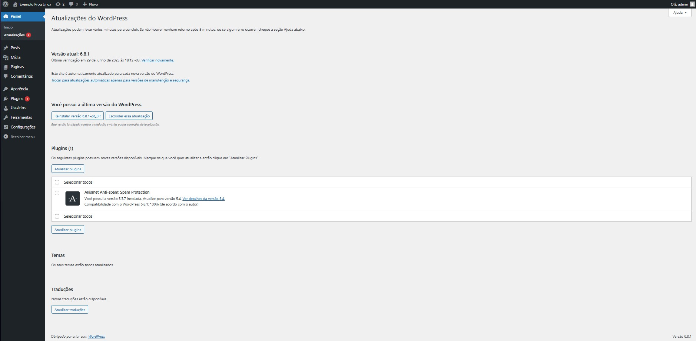

---

### 2- Posts
> Seção onde você gerencia os **posts do blog**.
>
> 1. **Todos os posts**  
>    Lista todos os artigos publicados ou em rascunho.
> 2. **Adicionar novo**  
>    Abre o editor para criar um novo post.
> 3. **Categorias**  
>    Cria ou edita categorias para organizar seus posts.
> 4. **Tags**  
>    Define palavras-chave que descrevem seus posts.

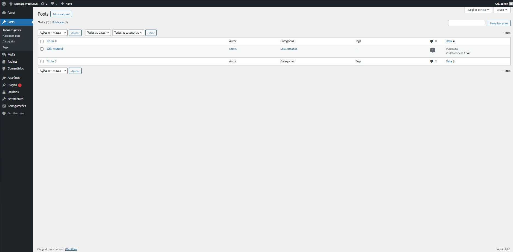

---

### 3- Mídia
> Biblioteca de **arquivos enviados**, como imagens, vídeos, PDFs.
>
> 1. **Biblioteca**  
>    Mostra todos os arquivos enviados, com opções de edição.
> 2. **Adicionar novo**  
>    Permite enviar novos arquivos diretamente.

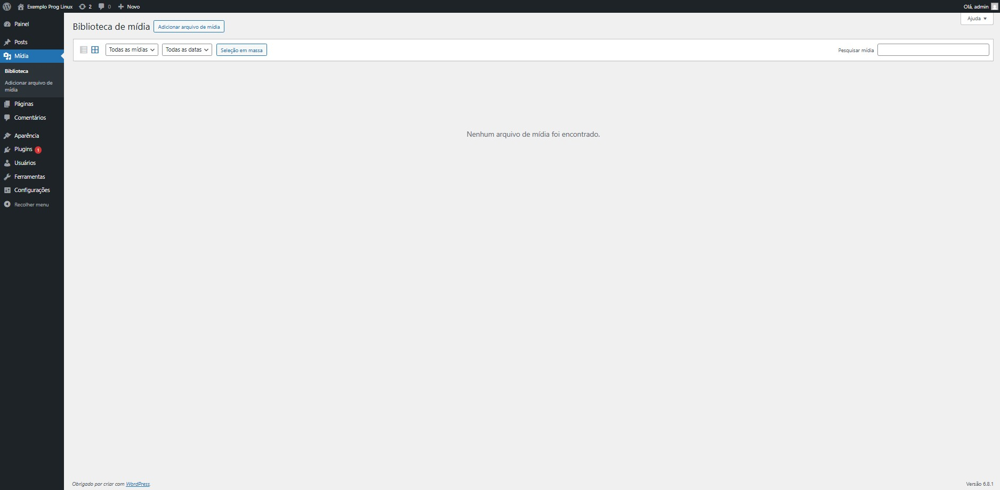

---

### 4- Páginas
> Gerencia páginas estáticas do site (ex: Sobre, Contato).
>
> 1. **Todas as páginas**  
>    Lista e permite editar/excluir páginas existentes.
> 2. **Adicionar nova**  
>    Cria uma nova página com o editor de blocos.

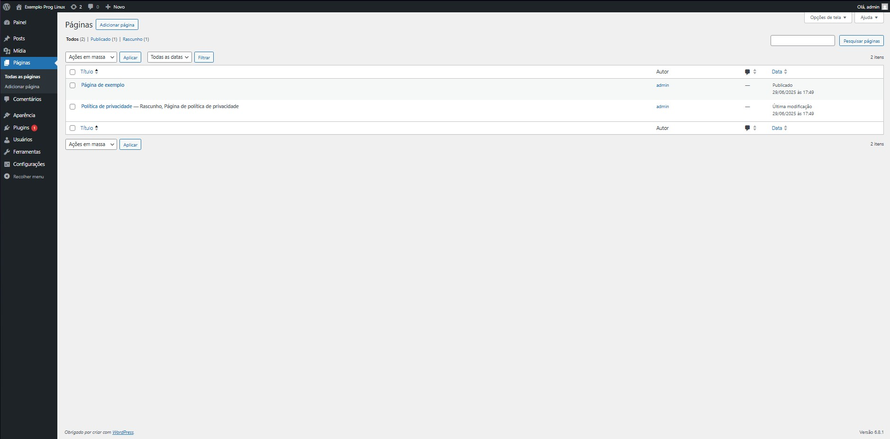

---

### 5- Comentários
> Central de **moderação de comentários** feitos por visitantes.
>
> - Aprovar, rejeitar, marcar como spam ou responder.
> - Útil para manter o conteúdo limpo e organizado.
> - Os ícones coloridos ajudam a identificar o status dos comentários.

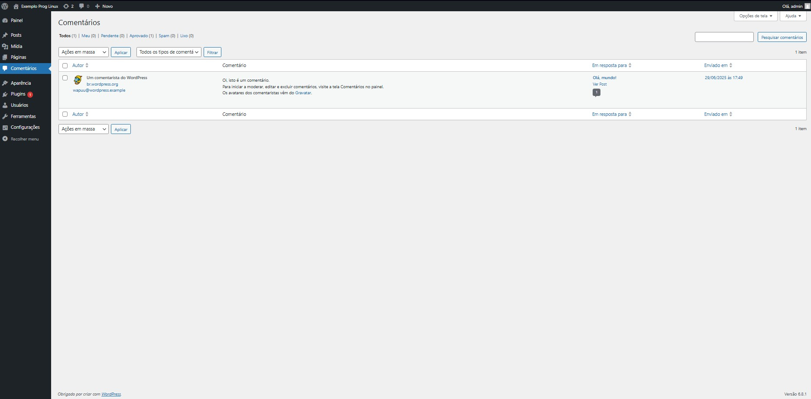

---

### 6- Aparência
> Personalização visual do site, temas e estrutura.
>
> 1. **Temas**  
>    Instala, ativa ou remove temas.
> 2. **Personalizar**  
>    Acessa o personalizador visual com pré-visualização.
> 3. **Widgets**  
>    Gerencia blocos reutilizáveis (como sidebar e rodapé).
> 4. **Menus**  
>    Cria e organiza menus de navegação.
> 5. **Editor de arquivos**  
>    (opcional) Edita diretamente os arquivos do tema. ⚠️ **Cuidado: pode quebrar o site.**

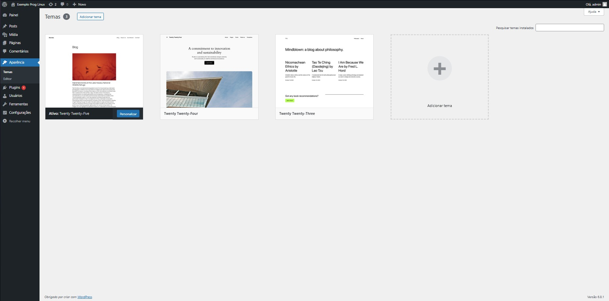

---

### 7- Plugins
> Adiciona funcionalidades extras ao WordPress.
>
> 1. **Plugins instalados**  
>    Lista e permite ativar/desativar plugins.
> 2. **Adicionar novo**  
>    Busca e instala plugins a partir do repositório oficial.
> 3. **Editor de plugins**  
>    ⚠️ Permite alterar o código dos plugins instalados.

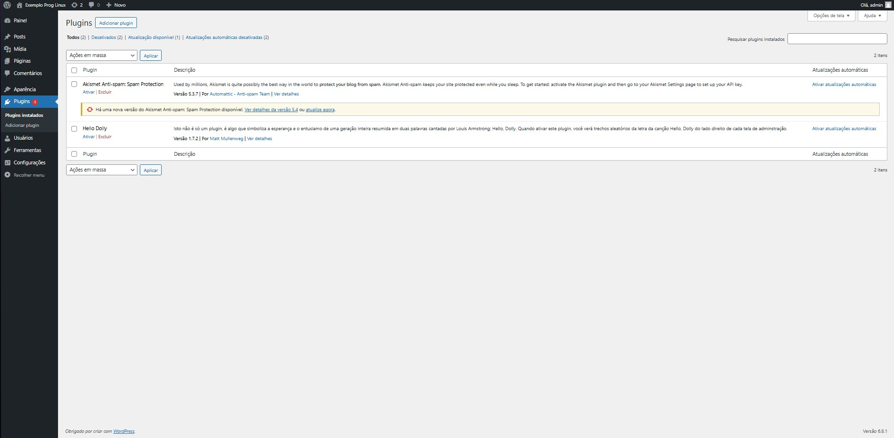

---

### 8- Usuários
> Gerencia quem pode acessar o painel e com que permissões.
>
> 1. **Todos os usuários**  
>    Lista e edita usuários cadastrados.
> 2. **Adicionar novo**  
>    Cria um novo usuário com função específica (Administrador, Editor, etc).
> 3. **Perfil**  
>    Configurações e dados do seu próprio perfil (foto, senha, etc).

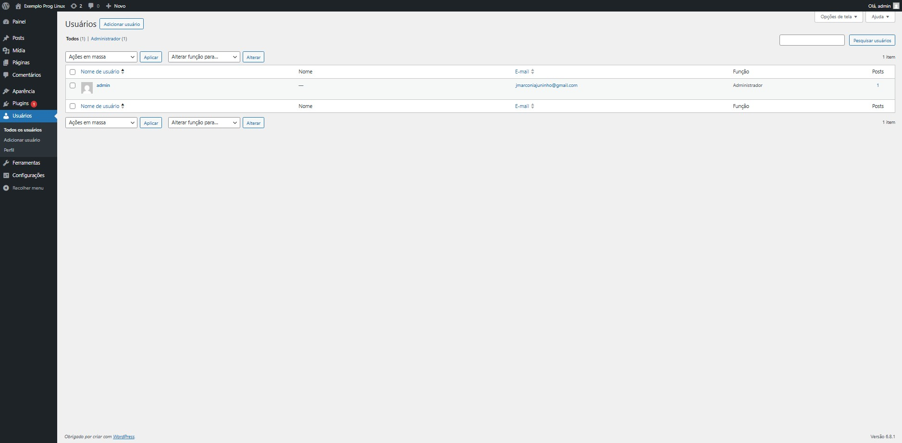

---

### 9- Ferramentas
> Conjunto de recursos administrativos diversos.
>
> 1. **Ferramentas disponíveis**  
>    Inclui funções como "Converter categorias em tags".
> 2. **Importar/Exportar**  
>    Migração de conteúdo entre sites.
> 3. **Saúde do site**  
>    Diagnóstico de performance e segurança.
> 4. **Exportar dados pessoais / Apagar dados**  
>    Ferramentas de conformidade com a LGPD/GDPR.

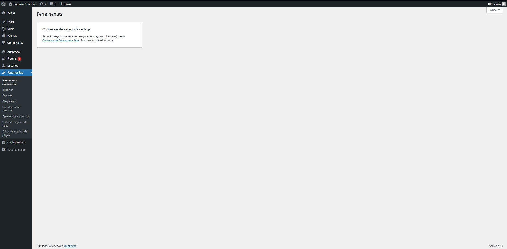

---

### 10- Configurações
> Ajustes fundamentais do site.
>
> 1. **Geral**  
>    Nome do site, URL, idioma, fuso horário.
> 2. **Escrita**  
>    Opções de publicação padrão.
> 3. **Leitura**  
>    Define qual página é a inicial e quantos posts por página.
> 4. **Discussão**  
>    Controle de comentários e moderação.
> 5. **Mídia**  
>    Tamanhos padrão para imagens.
> 6. **Links permanentes**  
>    Formato das URLs dos posts e páginas.
> 7. **Privacidade**  
>    Política de privacidade do site.

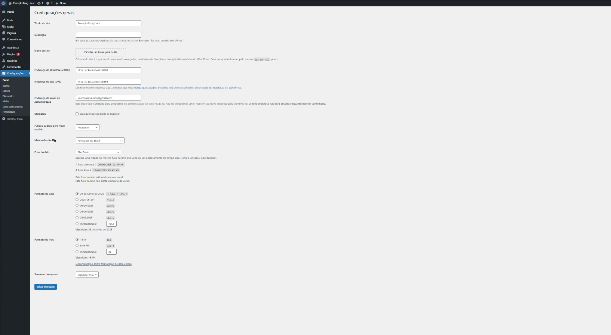

## 11 - Visualização do site
> Visualizar a página que está sendo feita
> Obs: Normalmente depois de criado o site, a url quando digitada jogará direto nessa página:


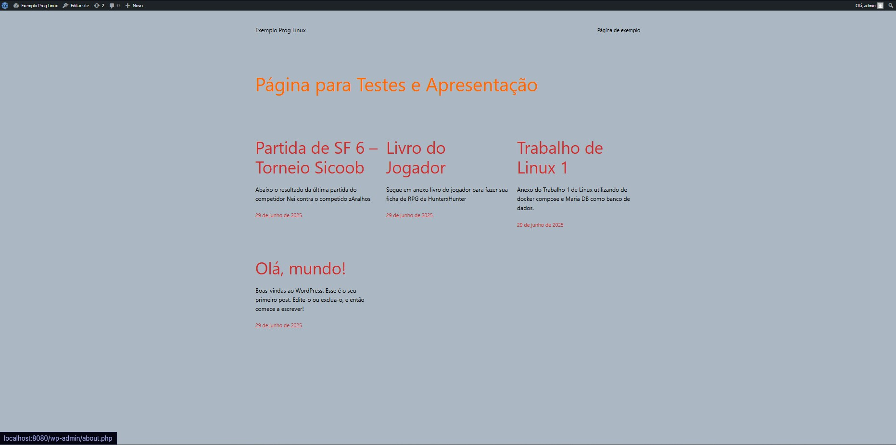


## Referências
https://hub.docker.com/_/wordpress

https://hub.docker.com/_/mariadb
